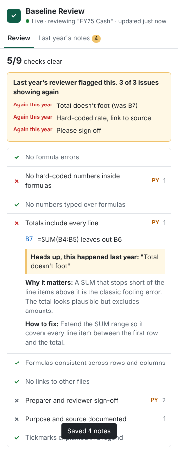

# Baseline Review

A live review checklist inside Excel. As a junior works on a workpaper, Baseline checks it the way a
senior would, and if last year's reviewer raised the same issue, it says so.

**Reviewer catalog.** *Workpaper basics* run on every sheet. On top of that, each sheet gets a **procedure
reviewer** from the catalog (bank rec, search for unrecorded liabilities, revenue cut-off, AR confirmations, with
more coming). Baseline suggests one from the sheet's name and headings, and the junior confirms. A procedure reviewer
adds its own completeness checklist ("row 10: service date missing") and **insights**: high-risk items found
in the testing data, like an invoice dated after year-end for a December service, with totals and click-to-jump.



## Procedure reviewers

| Reviewer | Finds |
|---|---|
| 🏦 Bank reconciliation | rec not agreeing to the GL, stale cheques, items cleared before year-end, cheques dated after year-end, large uncleared items |
| 🔎 Search for unrecorded liabilities | post-year-end invoices for this year's services, pre-year-end invoices not in AP, items with no service date |
| 📦 Revenue cut-off | sales recorded this year but shipped next year (and the reverse), credit notes after year-end, large near-year-end sales with no conclusion |
| ✉️ AR confirmations | unexplained differences, non-responses with no alternative procedures, large balances never sent |

Each one also checks that every tested item is complete. Set the **year-end** and **threshold** once in the
Settings tab (saved in the workbook). To add a procedure, see [docs/ADDING_A_REVIEWER.md](docs/ADDING_A_REVIEWER.md).

## Workpaper basics (always on, updates live as you type)

| Check | What it catches |
|---|---|
| No formula errors | `#REF!`, `#DIV/0!`, `#N/A` … |
| No hard-coded numbers inside formulas | `=A1*1.05`, `=SUM(B2:B9)+500` |
| No numbers typed over formulas | a typed value in the middle of a row of identical formulas |
| Totals include every line | `=SUM(B2:B8)` when B9 also has a number |
| Formulas consistent across rows and columns | the one formula that differs from its neighbours |
| No links to other files | `='[Budget.xlsx]Sheet1'!A1` |
| Preparer and reviewer sign-off | missing or blank "Prepared by" / "Reviewed by" |
| Purpose and source documented | no "Purpose" or "Source" on the sheet |
| Tickmarks explained in a legend | ✓ √ ^ used with no legend |

Every item explains **why it matters** and **how to fix it**, and clicking a cell reference jumps to that cell.

## Demo video

[▶ Watch the 2-minute demo](https://hmacknak.github.io/Baseline/) (also at
[`demo/Baseline-demo-video.mp4`](demo/Baseline-demo-video.mp4)). The spreadsheet in the video is simulated; the
panel is the real add-in code running against it. To re-record, see `demo/video/record.mjs`.

## Demo workbook

[`demo/Baseline-demo.xlsx`](demo/Baseline-demo.xlsx) (also on the install page) has a bank rec with 5 problems, an AR
aging with 3, a clean fixed-asset sheet, one sheet per procedure reviewer with planted risks, and a
`PY Notes` sheet to import. Follow its **Start here** tab.
Rebuild it with `python3 demo/make_demo.py`.

## Last year's review notes

Paste last year's review notes into the **Last year's notes** tab (or keep them on a sheet called
`PY Notes` and click Import). One note per line:

```
Cash | B12 | Hard-coded FX rate, link to source
Cash | Please sign off and date
AR | Total doesn't foot
Where is the tickmark legend?
```

Baseline matches notes to this year's sheet (year labels are ignored, so `FY24 Cash` matches `FY25 Cash`)
and shows each one as **Again this year**, **Looks fixed** or **Check yourself**. When a failing check
matches a PY note, it says *"Heads up, this happened last year."*

Notes are saved **inside the workbook**, so they roll forward with the file. **Nothing leaves Excel.**
There is no AI and no server in this version.

## Install it (no coding needed)

1. Go to **https://hmacknak.github.io/Baseline/** and tap **Download add-in file**.
2. Open **Excel on the web** (office.com), then open any workbook.
3. Go to **Home → Add-ins → More Add-ins → My Add-ins → Upload My Add-in**, and choose `manifest.xml`.
4. Click **Review** on the Home tab. The checklist opens and updates as you work.

The add-in is hosted on GitHub Pages and republished automatically every time `main` changes
(`.github/workflows/pages.yml` runs the tests first).

## Run it (developer)

```bash
npm install
npm test          # engine tests
npm start         # opens Excel with the add-in sideloaded
```

Other commands: `npm run typecheck`, `npm run build`, `npm run validate` (needs internet).

## Layout

```
src/review/     review engine: checks, formula lexer, PY notes, table reader (pure TypeScript, no Excel)
src/review/reviewers/  the catalog: workpaper basics + one file per procedure reviewer
src/excel/      everything that talks to Excel (reading the sheet, settings, events)
src/taskpane/   the panel UI
tests/          vitest tests for the engine
legacy/         the original Excel Coach shortcut trainer, kept for reference
docs/           vision, decisions, screenshots
```
